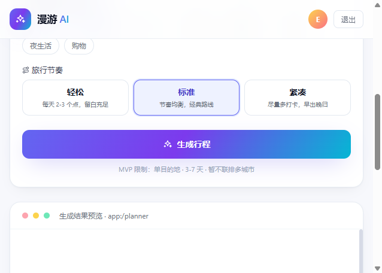
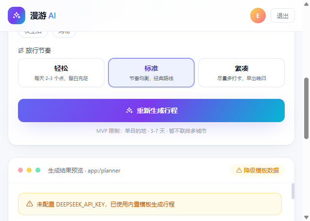
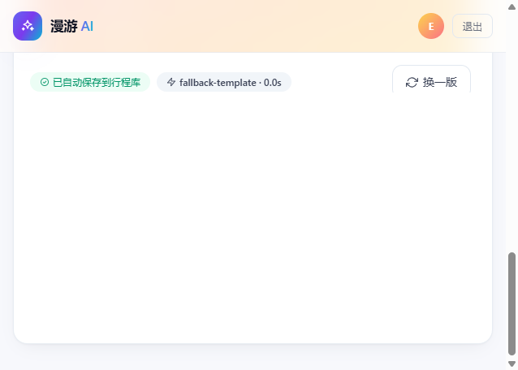
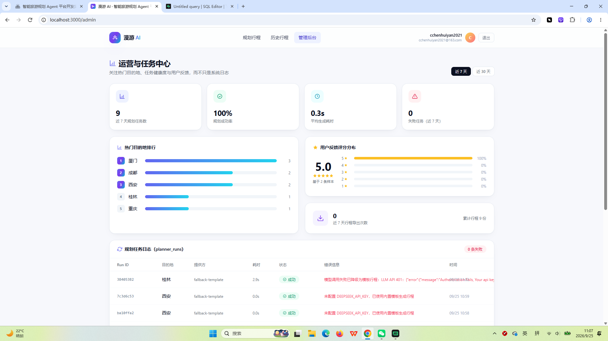
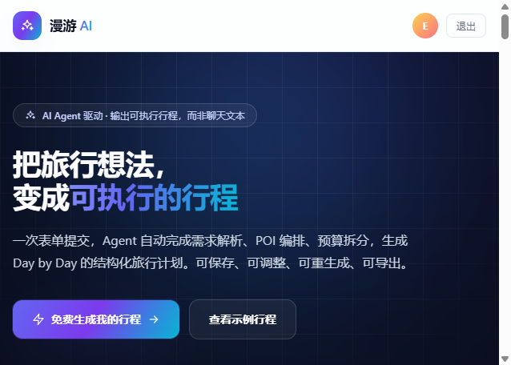

# 漫游 AI · 智能旅游规划 Agent 平台

基于 LLM Agent 的智能旅游行程规划平台：输入出发地、目的地、日期与预算，由 AI Agent 自动生成**按天结构化行程、预算分类拆分与出行建议**，全程任务状态可追溯，支持历史管理、一键重新生成与导出。

     

**线上演示**：<https://ai-trip-planner-seven-beta.vercel.app>

> 国内直连 `vercel.app` 不稳定，建议开启代理访问。
> 演示账号：`e2e-planner@test.local` / `e2e123456`（名下含多条演示行程与后台数据），也可自行注册；管理后台需数据库白名单账号。

## 功能预览

| 规划台 | 生成结果（Day by Day） |
|---|---|
|  |  |

| 预算拆分与出行建议 | 行程库（历史） |
|---|---|
|  |  |

| 管理后台 | 首页 |
|---|---|
|  |  |

## 核心功能

### 1. 智能规划（Agent 编排）

- **7 字段结构化输入**：出发地、目的地、出行日期（区间）、总预算、兴趣偏好（多选）、旅行节奏，与 PRD `POST /api/trips/plan` 请求体完全一致
- **输入硬校验**：出发地/目的地必填、日期区间实时天数计算（含首尾）、**3-7 天红线拦截**、单目的地限制
- **四阶段状态反馈**：解析需求 → 检索 POI → 编排日程 → 核算预算，配合骨架屏消除等待焦虑
- **结构化输出保障**：DeepSeek 强制 JSON 模式（`response_format: json_object`）→ 容错解析（自动剥离 Markdown 围栏）→ 强校验（天数不符、缺条目、非法类别即拒绝）→ 失败自动重试 1 次
- **优雅降级**：LLM 调用失败时降级为内置模板行程（页面明确提示降级原因），生成链路永不白屏

### 2. 行程结果展示

- **摘要卡**：目的地 · 天数、行程亮点、预估总预算（与逐项累计一致，预算误差 ≤ 10%）
- **Day by Day 时间线**：每日时段条目（开始/结束时间、地点、类别、预估费用、备注），类别含景点/餐饮/交通/住宿/购物/休闲
- **预算拆分**：按类别的彩色占比条 + 明细金额与百分比
- **出行建议**：Agent 生成的实用 tips 列表

### 3. 任务状态管理

- 成功 / 降级 / 失败三态贯穿生成全流程与详情页
- 每次生成（含重新生成）写入 `planner_runs` 日志：提供方、耗时、状态、**完整错误信息**
- 失败任务提供**三处重新生成入口**（生成失败态、行程详情页、历史卡片）

### 4. 行程库（历史管理）

- 行程生成后自动落库，列表页含统计条（份数 / 城市数 / 总预算）与状态筛选
- **按原条件重新生成**：一键复用原始输入重新规划，新行程另存、原行程保留
- **导出 Markdown**：含行程摘要、Day by Day、预算拆分与建议的完整文档，导出状态自动记录
- **评分反馈**：1-5 星 + 留言，直达管理后台

### 5. 管理后台

- 近 7/30 天窗口切换：规划任务数、成功率、平均生成耗时、导出次数等指标卡
- 热门目的地排行（基于行程聚合）
- 任务日志表：每次生成的提供方 / 耗时 / 状态 / 错误信息（降级原因、LLM 报错全量留痕）
- 用户反馈列表（脱敏邮箱）
- 权限：数据库白名单（`admin_emails` 表）+ `security definer` RPC 聚合跨用户数据，白名单外 API 与页面双重 403

### 6. 安全与隔离

- Supabase Auth 邮箱注册登录，SSR 会话自动刷新，路由守卫（未登录访问受保护页跳登录并携带回跳地址）
- Postgres **RLS 行级隔离**：用户仅能读写自己的行程、条目、日志与反馈
- 注册即自动建档（数据库触发器），独立 `trip` schema 管理会员档案，与业务表 `public` schema 逻辑分离

## 技术架构

```
浏览器（React 表单 / 结果展示 / 历史与管理后台）
   │
   │  POST /api/trips/plan（7 字段 JSON）
   ▼
Next.js Route Handlers（Node Runtime）
   │
   ├─ Agent 编排层（lib/agent/）
   │    prompt 构建 → DeepSeek 调用（120s 超时，失败重试 1 次）
   │    → JSON 容错解析 → 结构强校验 → 失败则内置模板降级
   │
   └─ 落库层（lib/agent/persist.ts）
        trip_plans + itinerary_days + itinerary_items（单事务写入）
        + planner_runs 任务日志
   ▼
Supabase Postgres（RLS 行级隔离）
   public:  trip_plans → itinerary_days → itinerary_items
            planner_runs · trip_feedback
   trip:    profiles（会员档案，触发器自动建档）
```

## 技术栈

| 层 | 技术 |
|---|---|
| 前端 | Next.js 14（App Router）· React 18 · Tailwind CSS · TypeScript |
| 后端 | Next.js Route Handlers（Node Runtime）· LLM Agent 编排层 |
| 数据库 | Supabase Postgres（RLS 行级安全、`security definer` RPC、触发器建档） |
| 鉴权 | Supabase Auth（邮箱 + 密码，`@supabase/ssr` SSR 会话） |
| LLM | DeepSeek Chat API（JSON 输出模式 + 降级模板兜底） |
| 部署 | Vercel（Git 集成，push main 自动部署） |

## 快速开始

```bash
git clone https://github.com/CHEN1998-create/ai-trip-planner.git
cd ai-trip-planner
npm install
cp .env.local.example .env.local   # 填入 Supabase 配置
npm run dev                        # http://localhost:3000
```

### 环境变量

| 变量 | 必填 | 说明 |
|---|---|---|
| `NEXT_PUBLIC_SUPABASE_URL` | 是 | Supabase 项目 URL |
| `NEXT_PUBLIC_SUPABASE_ANON_KEY` | 是 | Supabase anon public key |
| `DEEPSEEK_API_KEY` | 否 | DeepSeek API key；未配置时自动降级为内置模板行程 |
| `DEEPSEEK_BASE_URL` | 否 | 默认 `https://api.deepseek.com` |
| `DEEPSEEK_MODEL` | 否 | 默认 `deepseek-chat` |

> 国内开发注意：`npm run dev` 脚本内置本地代理（`HTTPS_PROXY=http://127.0.0.1:10808`，v2rayN 默认端口），用于 Node 服务器端访问 Supabase，请按本机代理端口调整；海外环境可移除这些变量。

### 数据库初始化

在 Supabase SQL Editor 中**按顺序**执行：

| 顺序 | 脚本 | 内容 |
|---|---|---|
| 1 | `supabase/migrations/20260924120000_init_trip_schema.sql` | 独立 `trip` schema、`profiles` 会员档案表、注册触发器与 `ensure_profile` RPC |
| 2 | `supabase/schema.sql` | 业务五张表 + 索引 + RLS 策略（`trip_plans` / `itinerary_days` / `itinerary_items` / `planner_runs` / `trip_feedback`） |
| 3 | `supabase/admin.sql` | 管理后台增量：`admin_emails` 白名单表、`is_admin()` / `admin_dashboard()` RPC、导出时间戳列 |

配置管理员：

```sql
insert into admin_emails (email) values ('your@email.com');
```

## 数据模型

```
trip_plans（行程主表：输入参数 + 状态 + 摘要/预算拆分/建议 JSON 列）
   │ 1:N
   ├─→ itinerary_days（行程日：day_index / 标题 / 小结 / 当日预算）
   │        │ 1:N
   │        └─→ itinerary_items（时段条目：时间 / 地点 / 类别 / 费用 / 排序）
   ├─→ planner_runs（任务日志：提供方 / 耗时 / 状态 / 错误信息）
   └─→ trip_feedback（用户反馈：1-5 星 / 留言）

trip.profiles（会员档案，注册触发器自动写入）
```

全部业务表启用 RLS，策略统一按 `auth.uid()` 限定归属；`planner_runs` 允许未成单的失败记录（`trip_plan_id` 可空）。

## API 一览

| 方法 | 路径 | 说明 |
|---|---|---|
| POST | `/api/trips/plan` | 行程规划：7 字段入参 → Agent 编排 → 结构化行程 + 落库（`status`: success / degraded；LLM 不可用时降级并在 `degradedReason` 说明） |
| GET | `/api/history` | 当前用户行程列表（RLS 自动隔离） |
| GET | `/api/trips/:id` | 行程详情（含按天条目、预算拆分、建议） |
| POST | `/api/trips/:id/regenerate` | 按原条件重新生成，新行程另存 |
| POST | `/api/trips/:id/export` | 导出 Markdown 文档并记录导出状态 |
| POST | `/api/trips/:id/feedback` | 提交评分（1-5）与留言 |
| GET | `/api/admin/planner-runs` | 管理后台聚合数据（窗口 7/30 天），白名单外 403 |

## 项目结构

```
app/
  (protected)/          # 登录守卫页面组（layout 做会话兜底校验）
    planner/            # 规划台：表单 + 四阶段生成 + 结果展示
    history/            # 行程库列表
    trips/[id]/         # 行程详情：Day by Day / 预算 / 反馈 / 重新生成 / 导出
    admin/              # 管理后台（is_admin RPC 校验）
  api/
    trips/plan/         # 行程规划入口
    trips/[id]/…        # 详情 / 重新生成 / 导出 / 反馈
    history/            # 列表
    admin/planner-runs/ # 后台聚合
  login/ register/      # 鉴权页
components/             # TripCard / ItineraryView / BudgetBreakdown / FeedbackCard / AuthProvider 等
lib/
  agent/                # Agent 编排层：prompt / llm / parse / fallback / run / persist
  supabase/             # client.ts（浏览器）/ server.ts（服务端）/ membership.ts（trip schema 档案）
  auth/                 # 应用标识与 schema 常量
docs/screenshots/       # README 截图
supabase/               # 数据库脚本（migrations / schema.sql / admin.sql）
```

## 部署

Vercel + GitHub 集成：push 到 `main` 自动构建部署。生产环境变量在 Vercel Project Settings 中配置（注意 `NEXT_PUBLIC_` 前缀变量需选 **Config** 类型才会暴露给客户端）。

## 常见问题

<details>
<summary>生成的行程为什么带"降级"提示？</summary>

未配置 `DEEPSEEK_API_KEY` 或 LLM 调用失败（网络 / 配额 / 鉴权）时，系统按 PRD 要求优雅降级为内置模板行程，提示条会展示具体原因；配置有效 key 后即恢复真实模型生成。
</details>

<details>
<summary>为什么行程天数限制 3-7 天？</summary>

PRD 约束（MVP 范围）：表单实时计算天数并红色拦截 2 天及以下、8 天及以上的输入，服务端二次校验。
</details>

<details>
<summary>本地 dev 访问 Supabase 报网络错误？</summary>

国内直连 `supabase.co` 不通，`npm run dev` 已内置本地代理注入（`HTTPS_PROXY`），请确认代理软件运行且端口与脚本一致。
</details>

<details>
<summary>管理后台显示无权限？</summary>

后台走数据库白名单（`admin_emails` 表），将账号邮箱插入该表即可；白名单外 API 与页面均返回 403。
</details>

## 相关文档

- [PRD.md](./PRD.md) —— 产品需求文档（页面结构、接口定义、表结构、验收标准）
